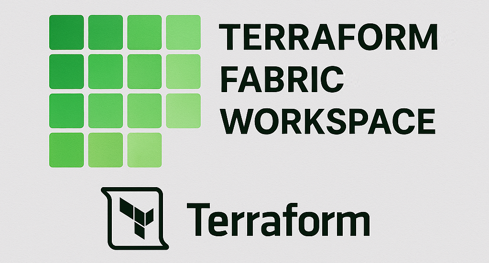

# Terraform Fabric Workspace


This repository provides a boilerplate Terraform configuration for deploying and managing resources in a Microsoft Fabric data platform. It includes modules and examples for provisioning and managing Fabric notebooks, along with a structured workspace setup.

## Features

- **Terraform Modules**: Modularized Terraform code for reusability and scalability.
- **Notebook Management**: Automates the deployment of Fabric notebooks with metadata and content.
- **Provider Configuration**: Pre-configured Microsoft Fabric provider setup.
- **Environment Variables**: Supports secure configuration using `terraform.tfvars.json`.


## Prerequisites

1. Install [Terraform](https://www.terraform.io/downloads.html).
2. Ensure you have access to a Microsoft Fabric tenant with the necessary permissions.
3. Configure your environment with the following:
   - `tenant_id`
   - `client_id`
   - `client_secret`

## Usage

### Step 1: Clone the Repository

```bash
git clone https://github.com/your-repo/fabric-data-platform.git
cd fabric-data-platform
```

### Step 2: Configure Variables
Create a terraform.tfvars.json file (or use the provided terraform.tfvars.json.example as a template) and populate it with your credentials and fabric workspace configurations:
```
{
  "fabric_provider": {
    "tenant_id": "your-tenant-id",
    "client_id": "your-client-id",
    "client_secret": "your-client-secret"
  },
  "fabric_notebooks": [
    {
      "workspace_id": "workspace-id-1",
      "display_name": "Notebook 1",
      "description": "Description for Notebook 1",
      "local_file_path": "notebooks/notebook1.ipynb"
    },
    {
      "workspace_id": "workspace-id-2",
      "display_name": "Notebook 2",
      "description": "Description for Notebook 2",
      "local_file_path": "notebooks/notebook2.ipynb"
    }
  ]
}
```

### Step 3: Initialize Terraform
Run the following command to initialize the Terraform workspace and download the required providers:
```
terraform init
```

### Step 4: Plan the Deployment
Generate an execution plan to preview the changes Terraform will make
```
terraform plan
```

### Step 5: Apply the Configuration
Apply the Terraform configuration to deploy the resources:
```
terraform apply
```